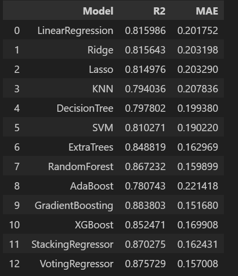
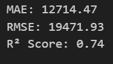
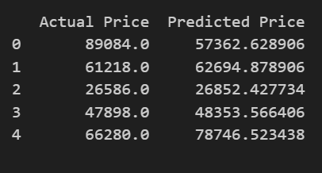
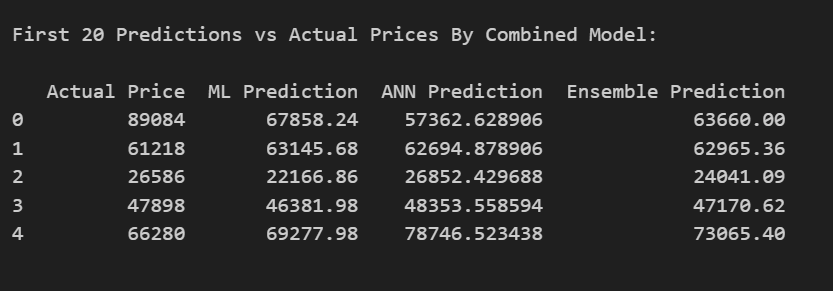
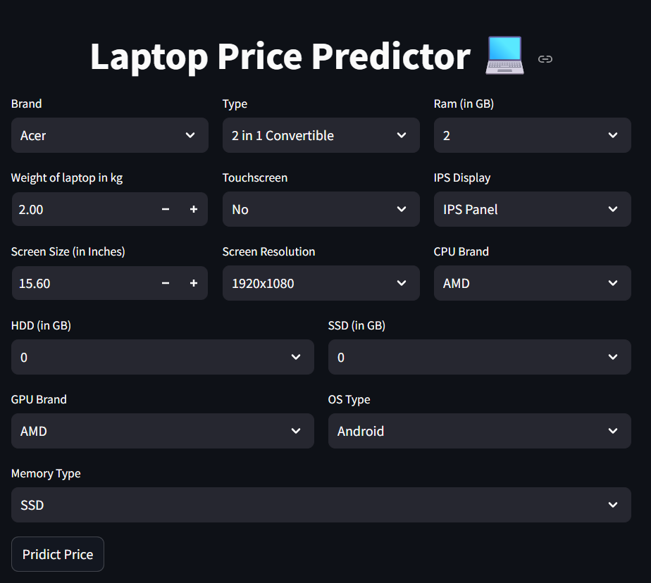

##                                              Laptop Price Prediction

Predict the price of a laptop based on its specifications such as screen size, RAM, processor, storage, GPU, and more.

A dataset containing **1303 laptop models** and their specifications.  
Each row includes:

- Company Name
- Product Name
- Laptop Type
- Screen Size (Inches)
- Screen Resolution
- CPU Model
- RAM (in GB)
- Memory Type and Size (HDD/SSD)
- GPU Model
- Operating System
- Weight (in Kg)
- **Price (Target variable)**

## Machine Learning Model : 

**Type:** Regression Problem  
Given the laptop's specifications, predict its price in Indian Rupees.

##  Performance Metrics

-  **R² Score** (Coefficient of Determination)  
-  **MAE** (Mean Absolute Error)

These metrics were used to evaluate the accuracy of each regression model trained.

## ANN Model :

A neural network with Embedding + Dense layers using TensorFlow/KerasTrained on label-encoded + scaled inputs

## Combined Model :

Weighted average of ML and ANN predictions for ensemble learning

##  Project Highlights :

-  Predicts laptop price from 13+ hardware features
-  Built an end-to-end pipeline with feature engineering
-  Streamlit dashboard** for live predictions
-  Visual model comparison & performance metrics

## Result :

**ML Model :**

**ANN Model :**

**Combined Model :**

# Dashboard Display :

# Result Comparision : 

Based on the evaluation, the ML model (GradientBoosting) is the most reliable for predicting laptop prices. The ANN and Ensemble models did not outperform the ML model and are not recommended for final deployment unless further tuning is done.

* Actual Price

* Predicted Price
